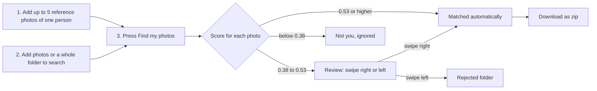
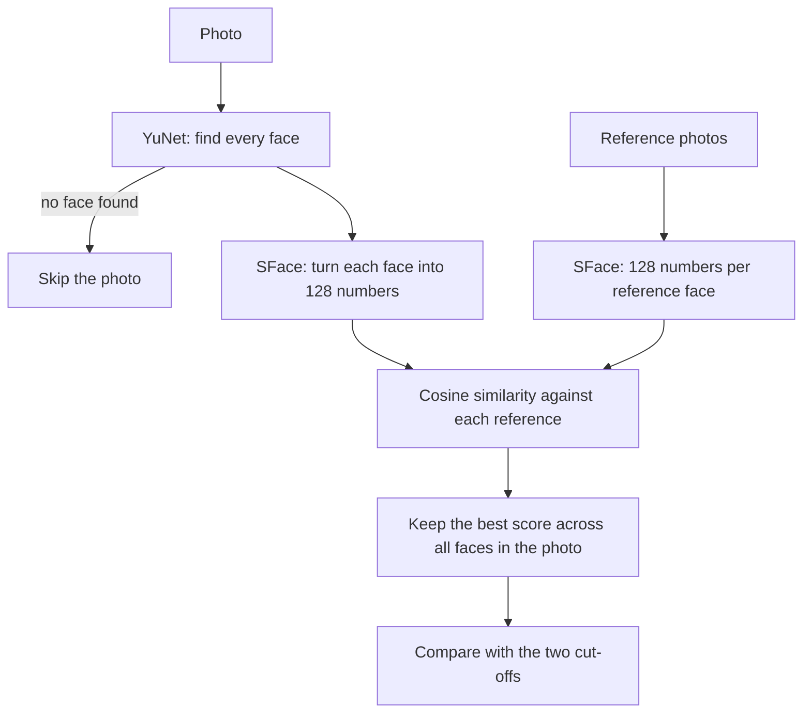
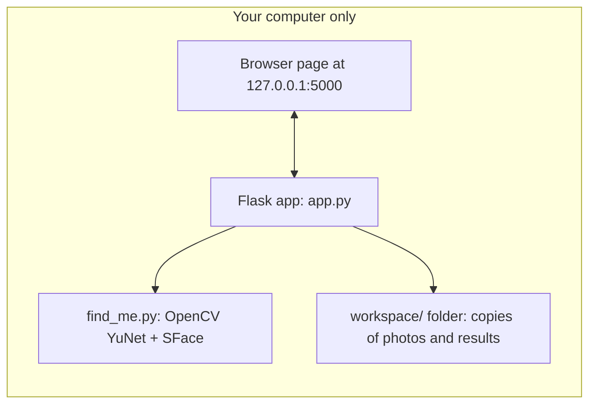

# FaceGotcha: find the photos you're in, from a group-chat photo dump, fully offline

Drop in a few photos of your face and a folder of group photos. FaceGotcha finds the ones you appear in, lets you swipe through the uncertain ones, and gives you a zip. It runs on your own computer with open-source face models, so nobody's face data is ever uploaded anywhere.

*Built for the [Hacktoberfest Weekend Challenge: Build for a Friend](https://dev.to/challenges/hacktoberfest-weekend-2026-10-01).*

<!-- TODO: replace with your demo video link and 1-2 screenshots (see "Demo" below) -->

## Demo

- Video: **[add your demo link here]**
- Screenshots: add images to a `docs/` folder and show them here, for example ``. Only use photos of yourself or people who said yes.

## Why I built it

One friend in my group has the phone with the best camera. She takes the photos, sends them all to the group chat, and everyone scrolls through hundreds of pictures to find the few they're in, saving them one by one. FaceGotcha does that search for you.

Photos of friends are private, and face data is biometric. So the whole point is that it runs **locally**: no accounts, no cloud, no API keys.

## How it works



What happens to each photo:



Where everything runs:



Think of each face as a fingerprint made of 128 numbers. Faces of the same person land close together, and faces of different people land far apart. The score is how close two fingerprints are.

## Open-source pieces

| Piece | What it does | Where it comes from |
|---|---|---|
| YuNet (`face_detection_yunet_2023mar.onnx`) | Finds faces in a photo | [OpenCV Zoo](https://github.com/opencv/opencv_zoo/tree/main/models/face_detection_yunet) |
| SFace (`face_recognition_sface_2021dec.onnx`) | Turns a face into a 128-number fingerprint | [OpenCV Zoo](https://github.com/opencv/opencv_zoo/tree/main/models/face_recognition_sface) |
| OpenCV | Runs both models on your CPU | [opencv-python](https://pypi.org/project/opencv-python/) |
| Flask | The local web page | [Flask](https://flask.palletsprojects.com/) |

Check the `LICENSE` file inside each model's folder in OpenCV Zoo for the exact terms before reusing the models. <!-- TODO: confirm both licenses and write them here -->

## Why open and local matters here

- **Privacy:** group photos and faces never leave the laptop. A cloud face-sorting service would have to receive every friend's face.
- **Cost:** it's free to run. There are no API keys, rate limits, or per-photo charges.
- **Works offline:** after the one-time model download, no internet is needed.
- **You can inspect and change it:** the models are small, the cut-offs are two numbers at the top of `app.py`, and you can swap in a different open model without asking anyone.

## Setup on your computer

### What you need

- **Python 3.10 or newer** ([python.org](https://www.python.org/downloads/))
- **Git** ([git-scm.com](https://git-scm.com/downloads)), or download the repo as a zip from GitHub
- About 100 MB of free disk space, plus room for your photos
- No GPU needed

### 1. Get the code

```bash
git clone https://github.com/<your-username>/<repo-name>.git
cd <repo-name>
```

### 2. Create a virtual environment and install

Windows (PowerShell):

```powershell
python -m venv .venv
.venv\Scripts\Activate.ps1
pip install -r requirements.txt
```

Windows (Git Bash):

```bash
python -m venv .venv
source .venv/Scripts/activate
pip install -r requirements.txt
```

macOS or Linux:

```bash
python3 -m venv .venv
source .venv/bin/activate
pip install -r requirements.txt
```

### 3. Download the two model files

Download these two files from OpenCV Zoo and put them in the `models` folder of this project:

1. [`face_detection_yunet_2023mar.onnx`](https://github.com/opencv/opencv_zoo/tree/main/models/face_detection_yunet) (about 230 KB)
2. [`face_recognition_sface_2021dec.onnx`](https://github.com/opencv/opencv_zoo/tree/main/models/face_recognition_sface) (about 37 MB)

Open each link, click the file name, then use the **Download raw file** button. Use these exact files, not the `int8` or `2026may` ones.

Check the sizes. If a file is only a few hundred bytes, you saved a pointer page instead of the model, so download it again.

### 4. Run it

```bash
python app.py
```

Open **http://127.0.0.1:5000** in your browser.

## How to use it

1. **Your face:** choose up to 5 clear photos of the same person. Solo photos work best.
2. **Photos to search:** add photos, or a whole folder, such as an unzipped WhatsApp chat export.
3. Press **Find my photos** and wait for the progress bar.
4. **Review:** swipe right if the photo is you and left if not (or use the arrow keys, and Z to undo). Check every face in the photo, because group shots can match on the wrong person.
5. **Download as zip**, or find the photos in `workspace/results/matched`.

Your uploads are **copied** into a `workspace` folder. Your original photos are never moved or deleted. "Start over" only removes that workspace folder.

### Getting photos out of WhatsApp

- WhatsApp Web and Desktop can't export chats. On the phone, use Export chat and attach media, but large chats often fail to save.
- A more reliable way is to open the group's Media, Links and Docs, select the photos, and save them to your phone gallery. Then copy them to your computer with a USB cable, iCloud Photos, or Google Drive.
- If the person who took the photos can send originals as documents or through a shared folder, you'll get better quality than WhatsApp's compressed copies.

### Command-line version

```bash
python find_me.py --refs my_refs --photos my_photos --out my_results --threshold 0.53 --review-floor 0.38
```

This copies matches to `my_results/matched`, borderline photos to `my_results/maybe`, and writes a `results.csv` with every score.

## Settings

Two numbers at the top of `app.py` control the sorting:

| Setting | Default | Meaning |
|---|---|---|
| `THRESHOLD` | 0.53 | At or above this, the photo is matched automatically |
| `REVIEW_FLOOR` | 0.38 | Between this and `THRESHOLD`, you decide by swiping |

Raise `THRESHOLD` for fewer wrong matches. Lower `REVIEW_FLOOR` to catch more of your photos at the cost of more swiping.

## How well does it work?

This is a **small test**: 55 WhatsApp photos from one group chat, 5 reference photos of one person (me). Treat the numbers as a first look, not a benchmark.

| Setting | Matched folder | Result |
|---|---|---|
| Threshold 0.363 (OpenCV's suggested default) | 35 photos | 8 were the wrong person |
| Threshold 0.53, review band 0.38 to 0.53 | no wrong photos | borderline photos go to review |

<!-- TODO: replace with your final counts from your own recount before publishing -->

- One photo of me scored 0.176 (a group shot) and was missed. No cut-off could catch it without flooding the review pile with wrong people.
- The cut-offs were tuned on this one sample. Other people, lighting, and reference photos will behave differently, and that's what the swipe review is for.

## Limitations

- WhatsApp compresses photos, so small faces in big group shots are the hardest case.
- It's tuned and tested on one person's face. Matching can be less accurate for other people.
- Side-on faces, sunglasses, and heavy shadow lower the score.
- It marks a photo as a match if *any* face in it matches, so always check the faces in review.
- HEIC photos are searched, but your browser may not show their thumbnails.
- It's a local single-user tool. Don't expose it to the internet.

## Privacy

- The page only listens on `127.0.0.1`, so other devices on your network can't open it.
- Face fingerprints exist only in memory while a search runs, and are not saved.
- The `.gitignore` keeps `workspace/`, `refs/`, `photos/`, and `results*/` out of the repository. Never commit photos of people.
- Ask the people in your photos before you run this on a shared chat.

## Project structure

```
app.py            local web app: uploads, search job, swipe review, zip download
find_me.py        the face search (also runs from the command line)
models/           put the two .onnx files here (not stored in the repo)
workspace/        created at runtime: copies of your photos and the results
requirements.txt  Python packages
```

## Built with

Python, Flask, OpenCV, and the OpenCV Zoo YuNet and SFace models. I designed the idea, tested it on my own photos, and tuned the cut-offs. I built it with AI assistance (Claude) for writing and explaining the code.

## License

<!-- TODO: add a LICENSE file (MIT is a common choice for a project like this) and name it here -->
The code is under the license in `LICENSE`. The models have their own licenses, linked above.
