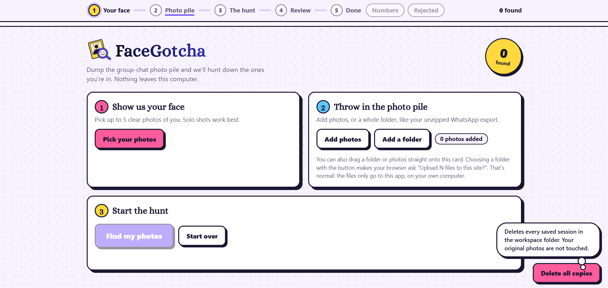
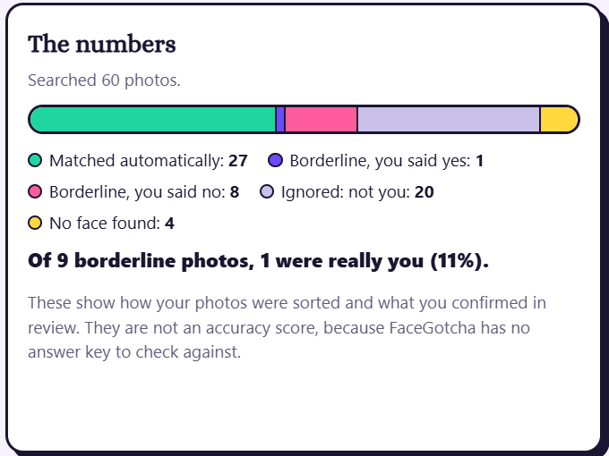
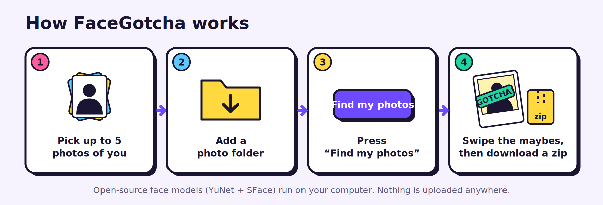
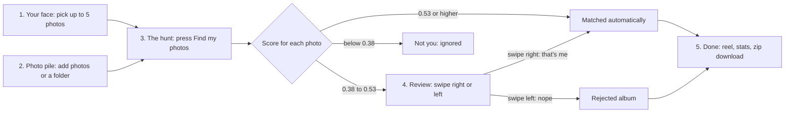
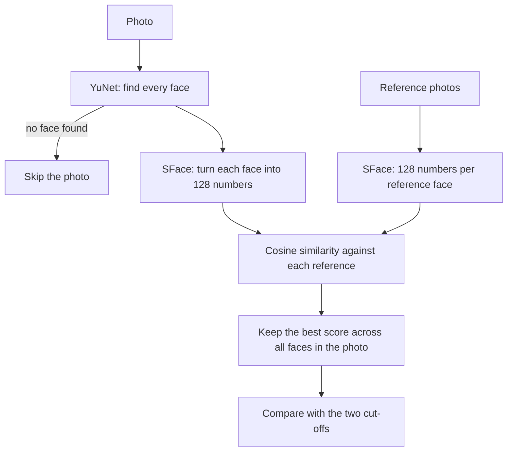
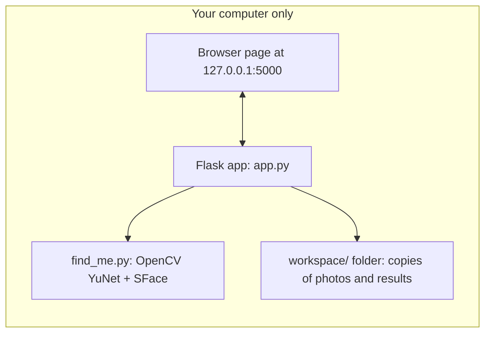
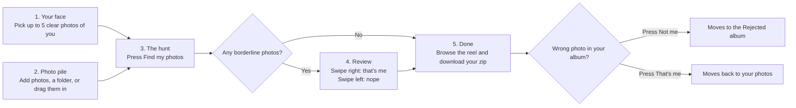

<p align="center"></p>

<h3 align="center">Find the photos you're in, from a group-chat photo dump, fully offline</h3>

Drop in a few photos of your face and a folder of group photos. FaceGotcha finds the ones you appear in, lets you **swipe** through the uncertain ones, and gives you a zip. It runs on your own computer with open-source face models, so nobody's face data is ever uploaded anywhere.

*Built for the [Hacktoberfest Weekend Challenge: Build for a Friend](https://dev.to/challenges/hacktoberfest-weekend-2026-10-01).*

## Contents

- [Demo](#demo)
- [Why I built it](#why-i-built-it)
- [The flow](#the-flow)
- [How it works under the hood](#how-it-works-under-the-hood)
- [Open-source pieces](#open-source-pieces)
- [Why open and local matters here](#why-open-and-local-matters-here)
- [Setup on your computer](#setup-on-your-computer)
- [How to use it](#how-to-use-it)
  - [Getting photos out of WhatsApp](#getting-photos-out-of-whatsapp)
  - [Command-line version](#command-line-version)
- [Settings](#settings)
- [How well does it work?](#how-well-does-it-work)
- [Limitations](#limitations)
- [Privacy](#privacy)
- [Looking ahead](#looking-ahead)
- [Project structure](#project-structure)
- [Built with](#built-with)
- [License and contact](#license-and-contact)

## Demo

- Video: [Watch the demo video](https://drive.google.com/file/d/1sbdd88orENvaOkqviMm3ljYHQgyU6LAl/view?usp=sharing)

<p align="center">
  
  
</p>

## Why I built it

One friend in my group has the phone with the best camera. She takes the photos, sends them all to the group chat, and everyone scrolls through hundreds of pictures to find the few they're in, saving them one by one. FaceGotcha does that search for you.

Photos of friends are private, and face data is biometric. So the whole point is that it runs **locally**: no accounts, no cloud, no API keys.

## The flow



A progress bar at the top of the page follows you through five steps: **Your face, Photo pile, The hunt, Review, Done**. Finished steps get a tick, so you always know what's next.



### Swipe to confirm

Most photos sort themselves: a high score is a match, a low score is ignored. Only the **borderline** photos in between need a human, and FaceGotcha shows them one at a time as a card. Swipe right for "that's me", left for "nope". You can also use the arrow keys or the buttons.

The review is designed to be quick and low-pressure:

- **One photo, one gesture.** No forms, checkboxes, or typing.
- **Easy to undo.** Press Z or the Undo button and the last card comes back, so a wrong swipe costs nothing.
- **Nothing is deleted.** "Nope" moves the photo to a Rejected album you can look through or download, so rejecting never feels final.
- **It only asks where it's unsure.** In my 60-photo test, 9 photos needed a decision, not all 60.

### What you get at the end

- A **scrolling reel** of your photos, with a **View all** button for the full grid and a **Not me** button under each photo to move it to the Rejected album
- A **stats bar** showing how every photo was sorted (matched automatically, borderline and you said yes, borderline and you said no, ignored, no face found)
- A **Rejected album** you can download as its own zip, with a **That's me** button under each photo to move it back
- A **zip** of all your photos

The stats describe how photos were sorted and what you confirmed in review. They are **not an accuracy score**, because the app has no answer key to check against. To measure accuracy you have to check the results yourself, as described in "How well does it work?" below.

## How it works under the hood

What happens to each photo:



Where everything runs:



Think of each face as a fingerprint made of 128 numbers. Faces of the same person land close together, and faces of different people land far apart. The score is how close two fingerprints are.

## Open-source pieces

| Piece | What it does | Where it comes from |
|---|---|---|
| YuNet (`face_detection_yunet_2023mar.onnx`) | Finds faces in a photo | [OpenCV Zoo](https://github.com/opencv/opencv_zoo/tree/main/models/face_detection_yunet) |
| SFace (`face_recognition_sface_2021dec.onnx`) | Turns a face into a 128-number fingerprint | [OpenCV Zoo](https://github.com/opencv/opencv_zoo/tree/main/models/face_recognition_sface) |
| OpenCV | Runs both models on your CPU | [opencv-python](https://pypi.org/project/opencv-python/) |
| Flask | The local web page | [Flask](https://flask.palletsprojects.com/) |
| Alice (`static/fonts/Alice-Regular.ttf`) | The heading font, served from your own computer so the page works offline | [Google Fonts](https://fonts.google.com/specimen/Alice), SIL Open Font License |

Both models come from OpenCV Zoo. YuNet is under the **MIT License** and SFace is under the **Apache 2.0 License**. See the `LICENSE` file in each model's folder for the exact terms.

## Why open and local matters here

- **Privacy:** group photos and faces never leave the laptop. A cloud face-sorting service would have to receive every friend's face.
- **Cost:** it's free to run. There are no API keys, rate limits, or per-photo charges.
- **Works offline:** after the one-time model download, no internet is needed.
- **You can inspect and change it:** the models are small, the cut-offs are two numbers at the top of `app.py`, and you can swap in a different open model without asking anyone.

## Setup on your computer

### What you need

- **Python 3.10 or newer** ([python.org](https://www.python.org/downloads/)). Tested on Windows with Python 3.11.
- **Git** ([git-scm.com](https://git-scm.com/downloads)), or download the repo as a zip from GitHub
- About 100 MB of free disk space, plus room for your photos
- No GPU needed

### 1. Get the code

```bash
git clone https://github.com/Ankita562/facegotcha.git
cd facegotcha
```

### 2. Create a virtual environment and install

Windows (PowerShell):

```powershell
python -m venv .venv
.venv\Scripts\Activate.ps1
pip install -r requirements.txt
```

Windows (Git Bash):

```bash
python -m venv .venv
source .venv/Scripts/activate
pip install -r requirements.txt
```

macOS or Linux:

```bash
python3 -m venv .venv
source .venv/bin/activate
pip install -r requirements.txt
```

### 3. Download the two model files

Download these two files from OpenCV Zoo and put them in the `models` folder of this project:

1. [`face_detection_yunet_2023mar.onnx`](https://github.com/opencv/opencv_zoo/tree/main/models/face_detection_yunet) (about 230 KB)
2. [`face_recognition_sface_2021dec.onnx`](https://github.com/opencv/opencv_zoo/tree/main/models/face_recognition_sface) (about 37 MB)

Open each link, click the file name, then use the **Download raw file** button. Use these exact files, not the `int8` or `2026may` ones.

Check the sizes. If a file is only a few hundred bytes, you saved a pointer page instead of the model, so download it again.

### 4. Run it

```bash
python app.py
```

Open **http://127.0.0.1:5000** in your browser.

## How to use it



1. **Your face:** choose up to 5 clear photos of the same person. Solo photos work best.
2. **Photo pile:** add photos or a folder (an unzipped WhatsApp export works). You can also drag them onto the card. Your browser may ask "Upload N files to this site?". That's normal: the files only go to this app, on your own computer.
3. **The hunt:** press **Find my photos**.
4. **Review:** swipe right for you, left for not you. Arrow keys work too, and Z undoes. Check every face, because group shots can match on the wrong person.
5. **Done:** download your zip. Use **Not me** and **That's me** to move photos between albums.

Your uploads are **copied**. Your original photos are never moved or deleted. Every time you open or refresh the page, a new timestamped folder (like `workspace/2026-10-04_14-32-10/`) starts a fresh session, so sessions stay separate. **Start over** also begins a new session without deleting the old one. Those copies stay on your disk until you remove them with the Delete all copies button in the bottom-right corner of the page (hover over it for an explanation; it asks first and tells you what it removed), or by deleting the `workspace` folder.

### Getting photos out of WhatsApp

- WhatsApp Web and Desktop can't export chats. On the phone, use Export chat and attach media, but large chats often fail to save.
- A more reliable way is to open the group's Media, Links and Docs, select the photos, and save them to your phone gallery. Then copy them to your computer with a USB cable, iCloud Photos, or Google Drive.
- If the person who took the photos can send originals as documents or through a shared folder, you'll get better quality than WhatsApp's compressed copies.

### Command-line version

```bash
python find_me.py --refs my_refs --photos my_photos --out my_results --threshold 0.53 --review-floor 0.38
```

This copies matches to `my_results/matched`, borderline photos to `my_results/maybe`, and writes a `results.csv` with every score.

## Settings

Two numbers at the top of `app.py` control the sorting:

| Setting | Default | Meaning |
|---|---|---|
| `THRESHOLD` | 0.53 | At or above this, the photo is matched automatically |
| `REVIEW_FLOOR` | 0.38 | Between this and `THRESHOLD`, you decide by swiping |

Raise `THRESHOLD` for fewer wrong matches. Lower `REVIEW_FLOOR` to catch more of your photos at the cost of more swiping.

## How well does it work?

This is a **small test**: 60 WhatsApp photos from one group chat, 5 reference photos of one person (me). Treat the numbers as a first look, not a benchmark.

| Setting | Result |
|---|---|
| Threshold 0.53, review band 0.38 to 0.53 | 27 matched automatically, 9 sent to review (I accepted 1 and rejected 8), 20 ignored as not me, 4 with no face found |

- Out of 60 photos, only 9 needed a decision from me.
- None of the 27 photos matched automatically was the wrong person.
- The cut-offs were tuned on this one sample. Other people, lighting, and reference photos will behave differently, and that's what the swipe review is for.

## Limitations

- WhatsApp compresses photos, so small faces in big group shots are the hardest case.
- It's tuned and tested on one person's face. Matching can be less accurate for other people.
- Side-on faces, sunglasses, and heavy shadow lower the score.
- It marks a photo as a match if *any* face in it matches, so always check the faces in review.
- Photos that score below the review floor are only counted, not saved, so they can't be recovered from the app.
- HEIC photos are searched, but your browser may not show their thumbnails.
- It's a local single-user tool. Don't expose it to the internet.
- If you move photos between albums with **Not me** / **That's me**, the Numbers section counts them as borderline decisions, so its bar and percentage can be slightly off.
- Dragging a folder onto the page works in desktop browsers (Chrome, Edge, Firefox), not on phones.

## Privacy

- The page only listens on `127.0.0.1`, so other devices on your network can't open it.
- Face fingerprints exist only in memory while a search runs, and are not saved.
- Copies of the photos you upload stay in `workspace/` until you delete them, so clear them when you're done with other people's photos.
- The `.gitignore` keeps `workspace/`, `refs/`, `photos/`, and `results*/` out of the repository. Never commit photos of people.
- Ask the people in your photos before you run this on a shared chat.

## Looking ahead

None of this is built yet. It's where I'd take it next.

- **Me and my best friend, in one go.** Add a second person's reference photos and get the photos with **both** of you, plus each person's solo photos, in one place. The tricky part is making sure two *different* faces in the photo match the two different people, so one friend who looks a bit like the other doesn't count as "both". The cut-offs would also need tuning per person, and the review step would need to ask "which friend is this?".
- **Birthday posts.** Pick a friend and collect every photo of them from the group dump, ready for a birthday post, collage, or shared album. This needs the friend's OK, since it builds a collection around their face.
- **A box around the matched face** in group photos during review, so you can see which face the app matched.
- **Learning from your swipes.** Use the photos you accepted and rejected to adjust the cut-offs for that person automatically.

## Project structure

```
app.py            local web app: uploads, search job, swipe review, results, zip downloads, and the page's HTML
find_me.py        the face search (also runs from the command line)
static/           style.css, app.js, fonts/ (the Alice font), img/ (logo and browser-tab icons)
docs/             the banner and the how-it-works graphic used in this README
models/           put the two .onnx files here (not stored in the repo)
workspace/        created at runtime: one timestamped folder per session, with copies of your photos and the results
requirements.txt  Python packages
LICENSE           the license for the code

```

## Built with

Python, Flask, OpenCV, and the OpenCV Zoo YuNet and SFace models. I designed the idea, tested it on my own photos, and tuned the cut-offs. I built it with AI assistance (Claude) for writing and explaining the code, and the logo and diagram were made with AI tools too.

The headings use the Alice font from Google Fonts (SIL Open Font License).

## License and contact

The code is released under the MIT License, see `LICENSE`. The models and the Alice font have their own licenses, linked above.

Feedback or questions: skibidz0805@gmail.com, or open an issue on GitHub.
